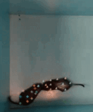

<h1 align="center">
<picture>
  <source media="(prefers-color-scheme: dark)" srcset="docs/source/_static/imgs/logos/DIPLOMAT_icon_large_light.svg">
  <source media="(prefers-color-scheme: light)" srcset="docs/source/_static/imgs/logos/DIPLOMAT_icon_large_dark.svg">
  
</picture>
</h1>

Deep learning-based Identity Preserving Labeled-Object Multi-Animal Tracking.

**NOTE:** DIPLOMAT is currently early beta software, there may be minor bugs and usability issues.

If you are a user (not a developer contributing code), you may want to visit:
- the software website: [https://wheelerlab.org/DIPLOMAT](https://wheelerlab.org/DIPLOMAT/)
- in-depth documentation: [https://diplomat.readthedocs.io](https://diplomat.readthedocs.io/en/latest)

## About

DIPLOMAT provides a multi-animal tracking/pose-estimation interface that (1) reduces identity swaps and body part losses, and (2) simplifies correction of automated tracking errors. 
Provided with a video and a pose estimation model (trained using [SLEAP](https://sleap.ai/tutorials/tutorial.html)
or [DeepLabCut](https://deeplabcut.github.io/DeepLabCut/docs/maDLC_UserGuide.html) packages), 
DIPLOMAT computes a multi-animal maximum-probability trace to _**Track**_ multiple animals (and their body parts).
DIPLOMAT then provides an intuitive and memory/time efficient _**Interact**_ interface to edit and re-track as needed. 
DIPLOMAT differs from other multi-animal tracking packages by working directly off of confidence maps instead of running peak detection, allowing for more accurate tracking results.


**Correcting and re-tracing on the Interact Interface**

| Example of tracking 2 Degus in a Box |                      Example of tracking 3 Rats                      |
|:------------------------------------:|:--------------------------------------------------------------------:|
|  |  |
## Installation

For detailed installation instructions, please refer to the [documentation](https://diplomat.readthedocs.io/en/latest/installation.html).

## Usage

Below, we provide a few simple instructions to remind users how to run DIPLOMAT commands. New users should 
read through the [documentation](https://diplomat.readthedocs.io/en/latest/basic_usage.html) to understand
project setup, etc.

#### Running DIPLOMAT

To run DIPLOMAT on a video once it is installed, simply use DIPLOMAT's `track` and `track_and_interact` commands to track a video:
```bash
# Run DIPLOMAT with no UI, for 4 animals ...
diplomat track -c path/to/config -v path/to/video -no 4
# Run DIPLOMAT with UI, for 3 animals ...
diplomat track_and_interact -c path/to/config -v path/to/video -no 3
```

Multiple videos can be tracked by passing them as a list:
```bash
diplomat track -c path/to/config -v [path/to/video1, path/to/video2, "path/to/video3"] -no <num_animals>
```

Once tracking is done, DIPLOMAT can create labeled videos via it's `annotate` subcommand:
```bash
diplomat annotate -v path/to/video -c path/to/csv
```

If you need to reopen the UI to make further major modifications, you can do so using the `interact` subcommand:
```bash
diplomat interact -s path/to/ui_state.dipui
```
This displays the full UI again for making further edits. Results are saved back to the same files.

If you need to make minor modifications after tracking a video, you can do so using the tweak subcommand:
```bash
diplomat tweak -v path/to/video -c path/to/csv
```
This will display a stripped down version of the interactive editing UI, allowing for minor tweaks to be made to the 
tracks, and then saved back to the same file.

For a list of additional ways DIPLOMAT can be used, see the [documentation](https://diplomat.readthedocs.io/en/latest/basic_usage.html).

#### Additional Help

All DIPLOMAT commands are documented via help strings. To get more information about a diplomat subcommand or command, simply run it with the `-h` or `--help` flag.

```bash
# Help for all of diplomat (lists sub commands of diplomat):
diplomat --help 
# Help for the track subcommand:
diplomat track --help
# Help for the predictors subcommand space:
diplomat predictors --help
```

Some commands support passing frontend-specific arguments. To get frontend specific help, you can use the `--help_extra` flag.
```bash
diplomat track -c /path/to/config --help_extra
diplomat track_and_interact -c /path/to/config --help_extra
diplomat track_with -c /path/to/config -p Predictor --help_extra
```

## Documentation

DIPLOMAT has documentation on ReadTheDocs at [https://diplomat.readthedocs.io/en/latest](https://diplomat.readthedocs.io/en/latest).

## Development

DIPLOMAT is written entirely in python. To set up an environment for developing DIPLOMAT, you can simply pull down this repository and install its
requirements using pip. For a further description of how to set up DIPLOMAT for development, see the 
[Development Usage](https://diplomat.readthedocs.io/en/latest/advanced_usage.html#development-usage) section in the documentation.

## Contributing

We welcome external contributions, although it is a good idea to contact the
maintainers before embarking on any significant development work to make sure
the proposed changes are a good fit.

Contributors agree to license their code under the license in use by this
project (see `LICENSE`).

To contribute:

  1. Fork the repo
  2. Make changes on a branch
  3. Create a pull request

## License

See `LICENSE` for details.

## Authors

If you have any questions, feel free to reach out to George Glidden, at [help@diplomattrack.org](mailto:help@diplomattrack.org)

See `AUTHORS` for the full list of authors.

